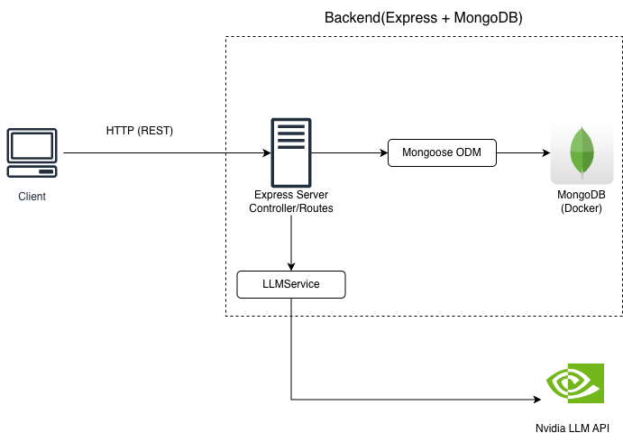

# LLM Chat Backend

A multi-session chat backend with LLM integration, built with **TypeScript + Node.js + Express + MongoDB**, fully containerized with Docker.

## Architecture



**Layering:** routes handle HTTP concerns only; business logic lives in the handlers/services; the LLM provider is abstracted behind an `LLMService` interface and injected through an app factory (`createApp(llm)`), which isolates the external dependency and makes it trivially mockable in tests.

## Prerequisites

- Node.js v22 or higher
- pnpm v9 or higher

## Quick Start

```bash
# 1. Configure environment
cp .env.example apps/server/.env
 
# 2. One-command startup (server + MongoDB)
docker compose up --build
 
# Server: http://localhost:3000
# API docs (Swagger UI): http://localhost:3000/docs
```

**Development mode:**
 
```bash
docker compose up -d mongo   # database in Docker
cd apps/server && pnpm dev   # server locally with watch mode
```
 
## Database Schema & Design
 
Two collections:
 
**sessions**
 
| Field | Type | Notes |
|---|---|---|
| `_id` | ObjectId | |
| `title` | String | defaults to "New Chat" |
| `createdAt` / `updatedAt` | Date | via Mongoose timestamps |
 
**messages**
 
| Field | Type | Notes |
|---|---|---|
| `_id` | ObjectId | |
| `sessionId` | ObjectId (indexed) | reference to the parent session |
| `role` | `'user' \| 'assistant'` | enum-validated |
| `content` | String | |
| `createdAt` / `updatedAt` | Date | |
 
**Design decision — reference over embedding:** messages live in their own collection and point back to a session via `sessionId`, instead of being embedded as an array inside the session document. Rationale: conversations grow without bound, so embedding would eventually hit MongoDB's 16MB document limit, and listing sessions would drag the full message history along. The trade-off is that deletion must cascade manually (`DELETE /sessions/:id` removes the session's messages first, then the session).
 
**How the model supports the required queries:**
- *Session list*: `Session.find().sort({ updatedAt: -1 })` — recently active sessions first.
- *Message history*: `Message.find({ sessionId }).sort({ createdAt: 1 })` — chronological order, served efficiently by the index on `sessionId`.
- *LLM context*: on each new user message, the full session history is loaded and passed to the LLM as the `messages` array, which is how the model "remembers" the conversation.
## API Documentation
 
Interactive Swagger UI is served at **`/docs`** (spec: `apps/server/src/openapi.json`).
 
| Method | Path | Description |
|---|---|---|
| POST | `/sessions` | Create a session |
| GET | `/sessions` | List sessions |
| GET | `/sessions/:id/messages` | Message history |
| POST | `/sessions/:id/messages` | Send a message, receive LLM reply (both persisted messages returned) |
| DELETE | `/sessions/:id` | Delete session + cascade-delete its messages |
 
## Testing
 
```bash
cd apps/server && pnpm test
```
 
**Approach:** integration-style tests with **Jest + Supertest**, hitting the Express app directly (no live port needed thanks to the app/server split). The LLM is the only external network dependency, so it is **replaced with a mock** implementing the `LLMService` interface — injected via `createApp(fakeLLM)` — which keeps tests fast, deterministic, and offline. Tests run against a dedicated database (`llm-chat-test`) that is dropped after each run. Coverage focuses on the core contracts: session creation/listing, message flow with mocked LLM reply, 404 cases, and cascade deletion.
 
## Build vs. Reuse Decisions
 
1. **Mongoose over the raw MongoDB driver** — schema validation, timestamps, and enum constraints out of the box, at the cost of one dependency. For a data model this small the modeling ergonomics clearly outweigh the abstraction cost.
2. **Hosted LLM API over a self-hosted local model** — NVIDIA's hosted, OpenAI-compatible endpoint delivers working inference in minutes with zero infrastructure. Self-hosting was deliberately deferred (listed as a bonus) since response quality is out of scope and setup time would crowd out core functionality.
3. **OpenAI SDK over a hand-rolled fetch client** — the endpoint is intentionally OpenAI-compatible, so reusing the SDK buys typed requests/responses and error handling for free, and switching providers is a one-line `baseURL` change. A hand-written HTTP client would only be justified in a zero-dependency constraint.